# ListenUp

**It is music player web app developed using Reactjs and Spotify API**.

This is the frontend repository

## Core packages

1. React Hooks (useState, useEffect, useRef)
2. React Router - Routing
3. Styling - Styled Components
5. Network calls - Axios

## Features

1. Login (using Spotify account)
2. Accessing Playlists
3. Accessing Recently Played Songs
4. Accessing Reccomendations
5. Play and Pause Songs (from playlists, recently played, reccomendations)
6. Traverse Playlist using next and previous button

## Running locally

run <code>npm i</code> and <code>npm start</code> to see the ListenUp in action

## Visit Online

Click on thev link below  to see the ListenUp in action

https://listenup.on.fleek.co/

## UI

 
<h3>Login</h3>
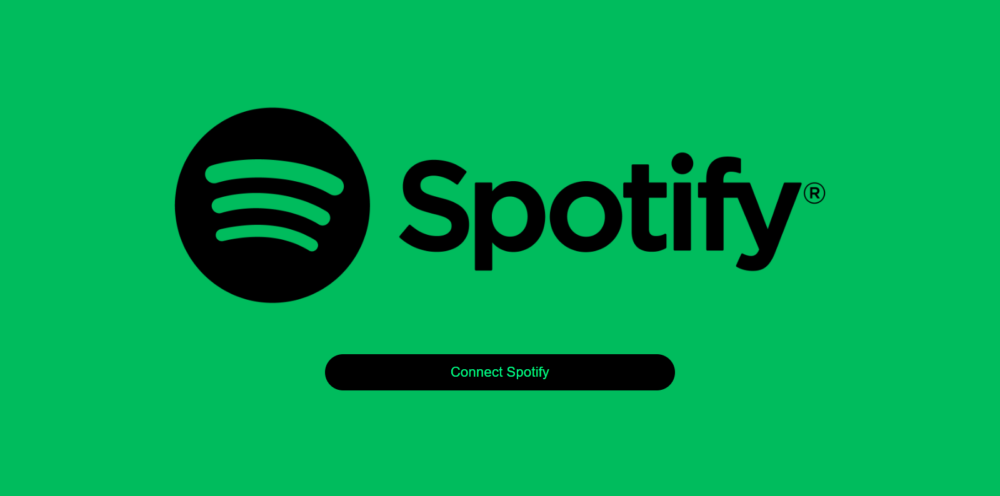

 
<h3>Home</h3>
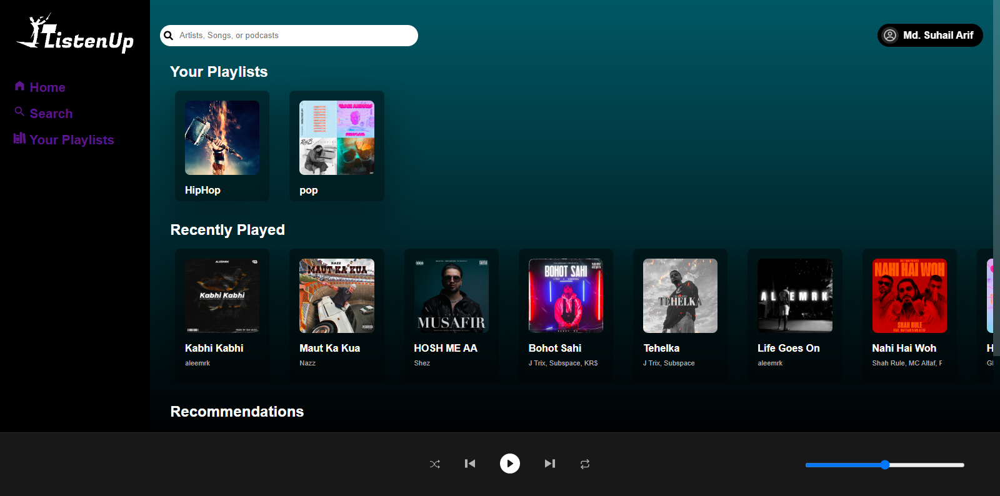
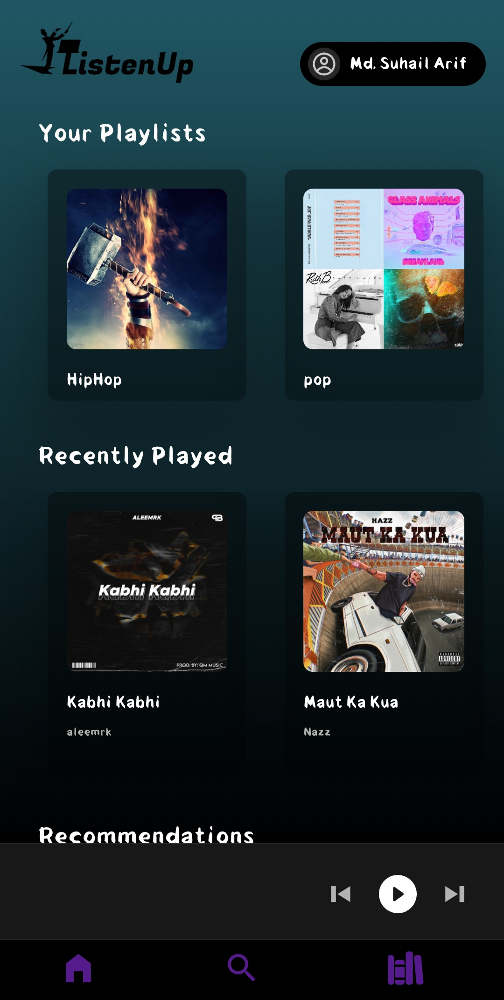

 
<h3>Search</h3>
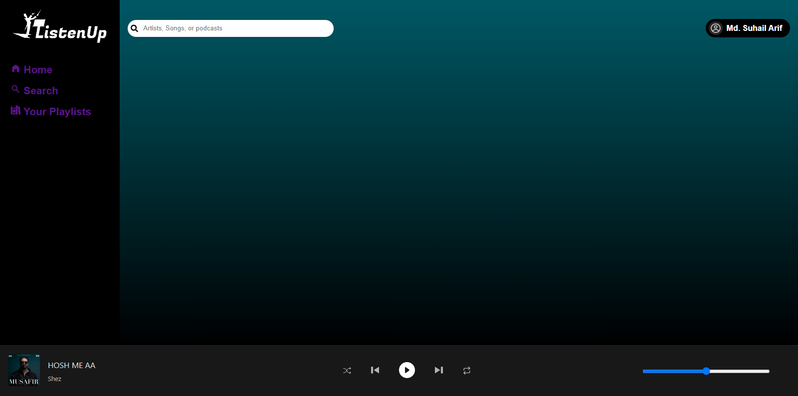
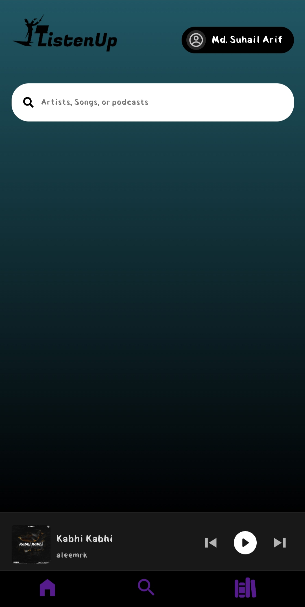

 
<h3>Playlist</h3>
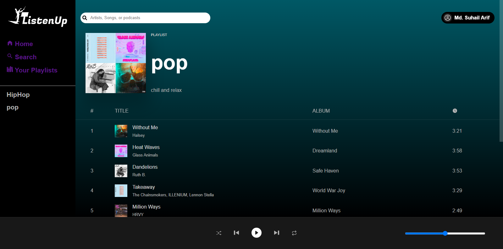
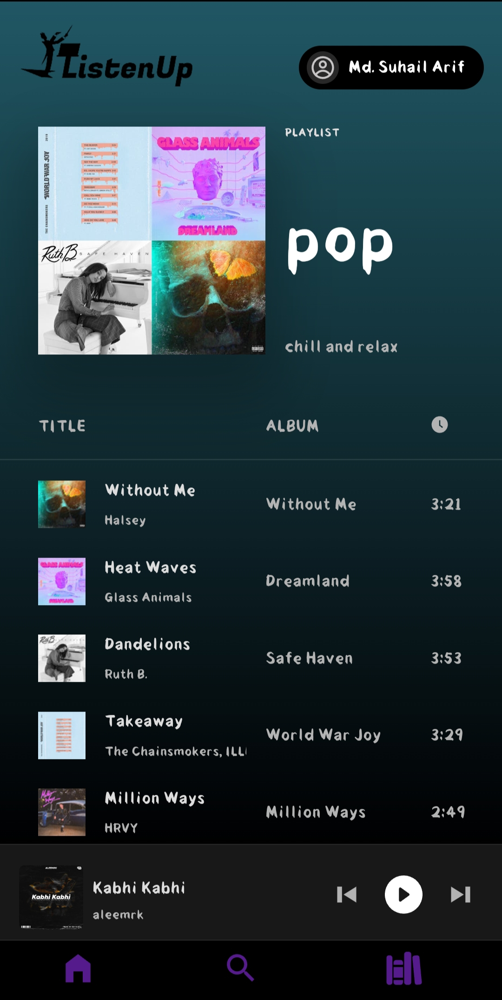

 
<h3>Song Selected</h3>
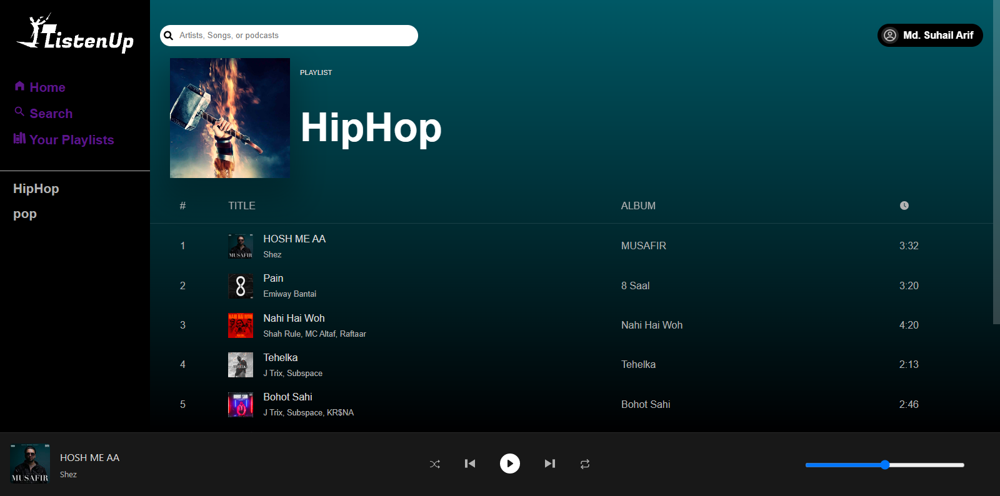
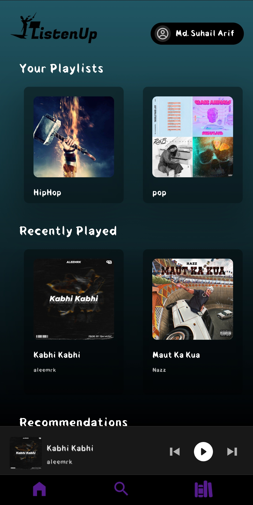

 
<h3>Playlist Scrolled</h3>
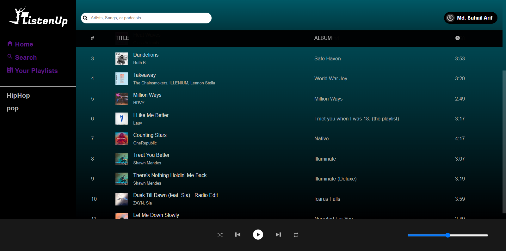
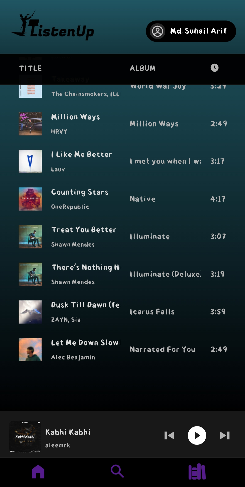

